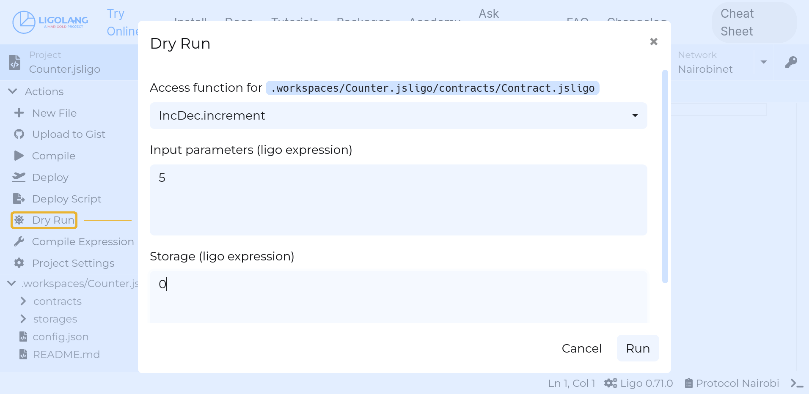

import Syntax from '@theme/Syntax';

## Entry points

A LIGO smart contract is made of a series of constant and function
declarations. Only functions having a special type can be called when
the contract is activated: we call them *entry points*. An entry point
function takes two parameters, the *contract parameter* and the
*on-chain storage*, and returns a pair made of a *list of operations*
and a (new) storage value.

A smart contract can export more than one entry point function.
An entry point can be selected by specifying its name when calling the contract.
For example, the following contract exports two functions, named `increment` and `decrement`.
The `increment` function can be called by passing `Increment (10)` to the contract (notice the capitalization of `Increment`).
More examples on how to perform this call are given below.

<Syntax syntax="jsligo">

```jsligo group=incdec
export namespace IncDec {
  type storage = int;
  type result = [list<operation>, storage];

  // Three entrypoints

  @entry
  const increment = (delta : int, store : storage) : result =>
    [list([]), store + delta];

  @entry
  const decrement = (delta : int, store : storage) : result =>
    [list([]), store - delta];

  @entry
  const reset = (_p : unit, _s : storage) : result =>
    [list([]), 0];
};
```

</Syntax>

<Syntax syntax="cameligo">

```cameligo group=incdec
module IncDec = struct
  type storage = int
  type result = operation list * storage

  (* Three entrypoints *)
  [@entry] let increment (delta : int) (store : storage) : result =
    [], store + delta
  [@entry] let decrement (delta : int) (store : storage) : result =
    [], store - delta
  [@entry] let reset (() : unit) (_ : storage) : result =
    [], 0
end
```

</Syntax>

When the contract is originated, the initial value of the storage is
provided. When an entry point is later called, only the parameter is
provided by the user, and the blockchain (or testing framework)
supplies the current storage value as a second argument.

The type of the contract parameter and the storage are up to the
contract designer, but the type for the list of operations is not.
The return type of an entry point is as follows, assuming that the type
`storage` has been defined elsewhere. (Note that you can use any type
with any name for the storage.)

<Syntax syntax="cameligo">

```cameligo skip
type storage = ...  // Any name, any type
type result = operation list * storage
```

</Syntax>

<Syntax syntax="jsligo">

```jsligo skip
type storage = ...;  // Any name, any type
type result = [list<operation>, storage];
```

</Syntax>

The contract storage can only be modified by activating an entry point:
given the state of the storage *on-chain*, an entry point function
specifies how to create another state for it, depending on the
contract's parameter.

## Calling a contract

### Using the dry-run command

In order to call the `increment` entry point of the smart contract, we can pass the `-m IncDec` option to specify the module and the `Increment(...)` constructor to specify the entry point (note the capitalization of `Increment`).

<Syntax syntax="cameligo">

```shell
ligo run dry-run -m IncDec gitlab-pages/docs/advanced/src/entrypoints-contracts/incdec.mligo 'Increment(5)' '0'
```

</Syntax>

<Syntax syntax="jsligo">

```shell
ligo run dry-run -m IncDec gitlab-pages/docs/advanced/src/entrypoints-contracts/incdec.jsligo 'Increment(5)' '0'
```

</Syntax>

In the command above, `0` is the initial `storage`, and `5` is the `delta` argument.

### Calling an on-chain contract

When a contract is deployed on-chain, the Michelson value for the parameter can be obtained with:

<Syntax syntax="cameligo">

```shell
ligo compile parameter -m IncDec gitlab-pages/docs/advanced/src/entrypoints-contracts/incdec.mligo 'Increment(5)'
```

</Syntax>

<Syntax syntax="jsligo">

```shell
ligo compile parameter -m IncDec gitlab-pages/docs/advanced/src/entrypoints-contracts/incdec.jsligo 'Increment(5)'
```

</Syntax>

In the command above, `Increment` is the (capitalized) name of the entry point to call, and `5` is the `delta` argument.

### Using the WebIDE

<Syntax syntax="cameligo">


</Syntax>

<Syntax syntax="jsligo">



</Syntax>

### Using the `ligo run test` command

A LIGO program can instantiate a new contract (or obtain an existing contract from its address),
and call one of its entry points by passing e.g. the parameter `Increment(5)`.

<Syntax syntax="cameligo">

```mligo
#import "gitlab-pages/docs/advanced/src/entrypoints-contracts/incdec.mligo" "C"

let test =
  let {addr ; code = _ ; size = _} = Test.originate (contract_of C.IncDec) 0 (0tez) in
  let _ = Test.transfer_exn addr (Increment 42) (0tez) in
  assert (42 = Test.get_storage(addr))
```

</Syntax>

<Syntax syntax="jsligo">

```jsligo
#import "gitlab-pages/docs/advanced/src/entrypoints-contracts/incdec.jsligo" "C"

const test = do {
  let {addr , code , size} = Test.originate(contract_of(C.IncDec), 0, 0tez);
  Test.transfer_exn(addr, Increment(42), 0tez);
  assert(42 == Test.get_storage(addr));
};
```

</Syntax>

The file above can be run with e.g. the `ligo run test` sub-command.

<Syntax syntax="cameligo">

```shell
ligo run test gitlab-pages/docs/advanced/src/entrypoints-contracts/test.mligo
```

</Syntax>

<Syntax syntax="jsligo">

```shell
ligo run test gitlab-pages/docs/advanced/src/entrypoints-contracts/test.jsligo
```

</Syntax>

## Main function

For more control over the contract's API, it used to be possible to declare
*one* main function called `main`, that dispatches the control flow
according to its parameter. When declaring *entrypoints* using the
`@entry` annotation, LIGO automatically generates a `main` function,
but it used to be possible to write such a function by hand instead of using
the `@entry` facility.

**This feature is now deprecated, future versions of LIGO will not allow the declaration of a single `main` function. A workaround is given at the end of this section.**

_While it is still possible to define a single function called `main` and mark it as the sole entry point using `@entry`, this is not what most programs should do. The following paragraphs are intended for programs which need more fine control over the behaviour of the entire program than what is possible using the automatic `@entry` mechanism._

As an analogy, in the C programming language, the `main` function is
the unique main function and any function called from it would be an
entrypoint.

Usually, the parameter of the contract is then a variant type, and, depending
on the constructors of that type, different functions in the contract
are called. In other terms, the unique main function dispatches the
control flow depending on a *pattern matching* on the contract
parameter.

In the following example, the storage contains a counter of type `nat`
and a name of type `string`. Depending on the parameter of the
contract, either the counter or the name is updated.

<Syntax syntax="cameligo">

```cameligo group=contract_main
type parameter =
  Action_A of nat
| Action_B of string

type storage = {
  counter : nat;
  name    : string
}

type result = operation list * storage

let entry_A (n : nat) (store : storage) : result =
  [], {store with counter = n}

let entry_B (s : string) (store : storage) : result =
  [], {store with name = s}

[@entry]
let main (action : parameter) (store: storage) : result =
  match action with
    Action_A n -> entry_A n store
  | Action_B s -> entry_B s store
```

</Syntax>

<Syntax syntax="jsligo">

```jsligo group=contract_main
export type parameter =
| ["Action_A", nat]
| ["Action_B", string];

export type storage = {
  counter : nat,
  name    : string
};

type result = [list<operation>, storage];

const entry_A = (n: nat, store: storage): result =>
  [list([]), {...store, counter: n}];

const entry_B = (s: string, store: storage): result =>
  [list([]), {...store, name: s}];

@entry
const main = (action: parameter, store: storage): result =>
  match(action) {
    when(Action_A(n)): entry_A(n, store);
    when(Action_B(s)): entry_B(s, store)
  };
```

</Syntax>

### Workaround for the deprecation of the `main` function

In most cases, adding `[@entry]` for CameLIGO or `@entry` for JsLIGO
before the existing `main` function should suffice. However in cases
where it is not possible or desiarable to convert an existing
`contract_main` contract to the new `@entry` format (e.g. generated
code or a code review process that forbids making changes to an
already-audited file), the deprecation can be circumvented by adding a
proxy file which declares a single entry point and calls the existing
`main` function, as follows:

<Syntax syntax="cameligo">

```cameligo group=contract_main_proxy
#import "gitlab-pages/docs/advanced/src/entrypoints-contracts/contract_main.mligo" "C"

module Proxy = struct

  [@entry]
  let proxy (p : C.parameter) (s : C.storage) : operation list * C.storage =
    C.main p s

end
```

The contract can then be compiled using the following command:

```shell
ligo compile contract -m Proxy contract_main_proxy.mligo
```

</Syntax>

<Syntax syntax="jsligo">

```jsligo group=contract_main_proxy
#import "gitlab-pages/docs/advanced/src/entrypoints-contracts/contract_main.jsligo" "C"

namespace Proxy {
  @entry
  const proxy =
    (p: C.parameter, s: C.storage): [list<operation>, C.storage] =>
    C.main(p, s)
}
```

The contract can then be compiled using the following command:

```shell
ligo compile contract -m Proxy contract_main_proxy.jsligo
```

</Syntax>

Notice that to compile a parameter for this contract, now we need to
pass the either `-e proxy` or construct a value using the `Proxy`
constructor:

<Syntax syntax="cameligo">

```shell
ligo compile parameter -m Proxy -e proxy contract_main_proxy.mligo "Action_A(42n)"
```

```shell
ligo compile parameter -m Proxy contract_main_proxy.mligo "Proxy(Action_A(42n))"
```

</Syntax>

<Syntax syntax="jsligo">

```shell
ligo compile parameter -m Proxy -e proxy contract_main_proxy.jsligo "Action_A(42n)"
```

```shell
ligo compile parameter -m Proxy contract_main_proxy.jsligo "Proxy(Action_A(42n))"
```

</Syntax>

## Tezos-specific Built-ins

A LIGO smart contract can query part of the state of the Tezos
blockchain by means of built-in values. In this section you will find
how those built-ins can be utilised.

### Accepting or Declining Tokens in a Smart Contract

This example shows how `Tezos.get_amount` and `failwith` can be used to
decline any transaction that sends more tez than `0tez`, that is, no
incoming tokens are accepted.

<Syntax syntax="cameligo">

```cameligo group=c
type parameter = unit
type storage = unit
type result = operation list * storage

[@entry]
let no_tokens (action : parameter) (store : storage) : result =
  if Tezos.get_amount () > 0tez then
    failwith "This contract does not accept tokens."
  else ([], store)
```

</Syntax>

<Syntax syntax="jsligo">

```jsligo group=c
type parameter = unit;
type storage = unit;
type result = [list<operation>, storage];

@entry
const no_tokens = (action: parameter, store: storage): result => {
  if (Tezos.get_amount() > 0tez) {
    return failwith("This contract does not accept tokens.");
  } else {
    return [list([]), store];
  };
};
```

</Syntax>

### Access Control

This example shows how `Tezos.get_sender` can be used to deny access to an
entrypoint.

<Syntax syntax="cameligo">

```cameligo group=c
let owner = ("tz1KqTpEZ7Yob7QbPE4Hy4Wo8fHG8LhKxZSx": address)

[@entry]
let owner_only (action : parameter) (store: storage) : result =
  if Tezos.get_sender () <> owner then failwith "Access denied."
  else ([], store)
```

</Syntax>

<Syntax syntax="jsligo">

```jsligo group=c
const owner = "tz1KqTpEZ7Yob7QbPE4Hy4Wo8fHG8LhKxZSx" as address;

const owner_only = (action: parameter, store: storage): result => {
  if (Tezos.get_sender() != owner) { return failwith("Access denied."); }
  else { return [list([]), store]; };
};
```

</Syntax>

> Note that we do not use `Tezos.get_source`, but instead
> `Tezos.get_sender`. In our [tutorial about
> security](../tutorials/security/security.md#incorrect-authorisation-checks)
> you can read more about it.

### Inter-Contract Invocations

It would be somewhat misleading to speak of "contract calls", as this
wording may wrongly suggest an analogy between contract "calls" and
function "calls". Indeed, the control flow returns to the site of a
function call, and composed function calls therefore are *stacked*,
that is, they follow a last in, first out ordering. This is not what
happens when a contract invokes another: the invocation is *queued*,
that is, follows a first in, first out ordering, and the dequeuing
only starts at the normal end of a contract (no failure). That is why
we speak of "contract invocations" instead of "calls".

It is possible to obtain the behaviour of normal function "calls" using
*views*, which are pure functions that do not modify the callee's on-chain
state. However, this section describes inter-contract invocations which
are queued, and may modify the callee's state.

The following example shows how a contract can invoke another by
emitting a transaction operation at the end of an entrypoint.

> The same technique can be used to transfer tokens to an implicit
> account (tz1, ...): all you have to do is use a unit value as the
> parameter of the smart contract.

In our case, we have a `counter` contract that accepts an action of
type `parameter`, and we have a `proxy` contract that accepts the same
parameter type, and forwards the call to the deployed counter
contract.

<Syntax syntax="cameligo">

```cameligo skip
(* gitlab-pages/docs/advanced/src/entrypoints-contracts/incdec.mligo *)

module IncDec = struct
  type storage = int
  type return = operation list * storage

  [@entry] let increment (delta : int) (store : storage) : return =
    [], store + delta
  
  (* And so on, as above *)
end
```

```cameligo group=d
(* proxy.mligo *)

type parameter =
  Increment of int
| Decrement of int
| Reset

type storage = unit

type result = operation list * storage

let dest = ("KT19wgxcuXG9VH4Af5Tpm1vqEKdaMFpznXT3" : address)

[@entry]
let proxy (action : parameter) (store : storage) : result =
  let counter : parameter contract = Tezos.get_contract_with_error dest "not found" in
  let op = Tezos.transaction (Increment 5) 0tez counter
  in [op], store
```

</Syntax>

<Syntax syntax="jsligo">

```jsligo skip
// gitlab-pages/docs/advanced/src/entrypoints-contracts/incdec.jsligo

export namespace IncDec {
  type storage = int;
  type ret = [list<operation>, storage];

  @entry
  const increment = (delta : int, store : storage) : ret =>
    [list([]), store + delta];

  // And so on, as above
};
```

```jsligo group=d
// proxy.jsligo

type parameter =
| ["Increment", int]
| ["Decrement", int]
| ["Reset"];

type storage = unit;

type result = [list<operation>, storage];

const dest = "KT19wgxcuXG9VH4Af5Tpm1vqEKdaMFpznXT3" as address;

const proxy = (action: parameter, store: storage): result => {
  let counter : contract<parameter> = Tezos.get_contract_with_error(dest, "not found");
  let op = Tezos.transaction(Increment(5), 0tez, counter);
  return [list([op]), store];
};
```

</Syntax>

<!-- updated use of entry -->